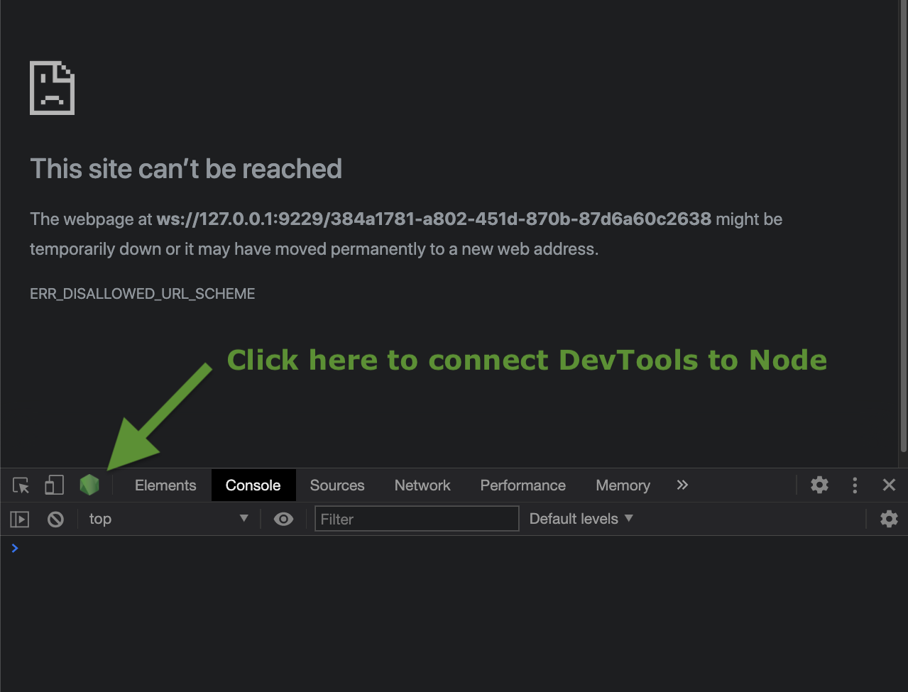

# Debugging Node with Dev-Tools Workshop
> This repo is designed to give a hands on demonstration to students about connecting the Chrome DevTools to Node for debugging purposes

## Table of Contents

- [Find the Bug in contrivedMath.js](#find-the-bug-in-contrivedmath.js)

- [Navigating the DevTools](#navigating-the-devtools)

- [Fix The Server](#fix-the-server)

- [Resources](#resources)

---

## Find the Bug in contrivedMath.js

- Lets start out working with the `contrivedMath.js` file.  First lets just run the file using node and see what we get.
  ```
  node contrivedMath.js
  ```
- It looks like a couple of ours test are failing. We could start by adding some console logs but instead lets attach our trusty Chrome DevTools and use those to debugger these math functions.
  - This time we will run the file passing the `--inspect-brk` flag to node. This flag opens a connection for debugging and also will pause (break) the code execution on the first line.  
    ```
    node --inspect-brk contrivedMath.js
    ```
    >_We will also use `--inspect` later witch does not pause execution on the first line_
  - You should see a line that reads something like: 
    ```
    Debugger listening on ws://127.0.0.1:9229/384a1781-a802-451d-870b-87d6a60c2638
    ```
  - Copy from `ws://` to the end of the line and past that in to the address bar of a new chrome tab.
  - Don't be surprised if it looks like you navigated to the wrong page, first open the console (⌘⌥J on Mac) and look for a green hexagon along the top of the DevTools panel. (See Image)

      
      
### Lets find that bug!
---
## Navigating the DevTools
>To dive deeper in to using DevTools please check the [DevTools Docs](https://developer.chrome.com/docs/devtools/) especially [Debug Javascript](https://developer.chrome.com/docs/devtools/javascript/)

### Advancing through the code
- Step ( F9 )
- Step Over Next Function Call ( F10 or ⌘' )
- Step Into Next Function Call ( F11 or ⌘; )
- Step Out of Current Function Call ( ⇧F11 or ⌘⇧; )
- Resume Execution ( F8 or ⌘\ )
- Play/Stop <!-- If you know the shortcuts for play/stop lemme know please -->
- Continue to here (⌘ + Click on a stopping point)

### Break Points
- Add them
- Remove them
- debugger (keyword)
- Make them conditional

### Debugger Panes
- Scope
- Call Stack
- Watch

> Connect DevTools to both `contrivedMath.js` and ` classExample.js` to practice using the various tools outlined above.
---

## Fix The Server

### Installation
> Requires Node v14.00.0 or higher to be installed

- From the root directory run `npm install`
- Open `server/config.example.js` and follow the instructions to create a `config.js` file with your GitHub authentication token

### Use DevTools To Inspect `req` and `gitHubRes` Variables 
- Nodemon can also be used while debugging just like with Node you just have to pass it the `--inspect` or the `--inspect-brk` flags.  Lets do that to start our server.
  ```
  nodemon --inspect server/server.js
  ```
  > Since we will be restarting the server while modifying code we are using `--inspect` here so that our code doesn't stop on the first line every time. Instead it will execute until it hits our first breakpoint or a `debugger` statement in the code.
- Connect the DevTools to Node again then uncomment the `debugger` statement on line 24 in `server.js`.
- In your browser go to http://localhost:3000 and submit something in the form.
- The DevTools should now be paused on line 24.  We can now try and have a look at the `req` object to see where we can find the supplied github user to search for.
  - One option is to use the Scope panel to explore the variable in scope
  - Another option is to use the Console to interact with the variables in scope.
    - Try typing `req` in the console then pressing enter
    - Try typing `req.headers` in the console then pressing enter
    - Try typing `req.query` in the console then pressing enter
  - The username value comes in attached as part of the `req.query` object at the key 'githubHandle'. On line 25 replace `'FIX ME'` with `req.query.githubHandle`.
  - See if you can pause the debugger to help you inspect the `gitHubRes` object to find the information you need to send back to the client. 


# Resources
- [Debugging Node Guide](https://nodejs.org/en/docs/guides/debugging-getting-started/) - From the Node Docs
- [Flavicopes Guide](https://flaviocopes.com/node-debug-devtools/) - Quick and simple guide to connecting DevTools to Node
- [Digital Ocean Debugger Tutorial](https://www.digitalocean.com/community/tutorials/how-to-debug-node-js-with-the-built-in-debugger-and-chrome-devtools#step-3-%E2%80%94-debugging-nodejs-with-chrome-devtools) - Dives deep in to using the debugger
- [DevTools Docs](https://developer.chrome.com/docs/devtools/)
- [Debug Javascript](https://developer.chrome.com/docs/devtools/javascript/)
- [DevTools Keyboard Shortcuts](https://developer.chrome.com/docs/devtools/shortcuts/)
